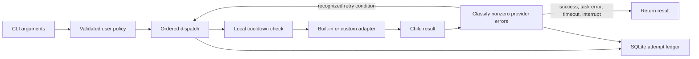

# Architecture

The implementation separates policy validation, subprocess execution, failure
classification, local cooldowns, and reporting. There are no runtime Python
dependencies beyond the standard library. The default policy is wheel package
data; installation does not depend on a source checkout.

## Failure behavior

Each configured engine gets one attempt in order unless it has a known active
cooldown. Skips are recorded. A recognized quota failure records a cooldown and
advances the chain. Authentication and model-rejection failures can advance the
chain without a cooldown. Unknown errors terminate the run. A missing adapter
binary is a configuration/runtime error and stops the run too.

Classification accepts explicit custom-adapter error records, selected structured
provider envelopes, and a small set of anchored CLI error sentences. A message
merely containing `401`, `429`, `authentication`, or `rate limit` is insufficient.
Likewise, authentication-like prose inside a completed result envelope, including
one marked as a task error, remains task output and does not trigger fallback.
Model-rejection messages are checked against an explicitly selected model.
Provider output can change; an unrecognized error stops rather than guessing.

Fallback cannot determine whether an earlier attempt already edited files or
performed external actions. Tasks are not transactional, and retries do not
provide exactly-once execution. A pin restricts execution to one configured
engine. Timeouts and interrupts always stop without fallback.

## Concurrency and limits

SQLite WAL with a busy timeout records concurrent attempts. Cooldown updates
hold a POSIX file lock and re-read before merging, so independent engine updates
are not lost. A corrupt cooldown cache is treated as unknown state with a warning;
this may allow another attempt against a provider whose cooldown was lost.

The runner does not queue tasks or enforce a global concurrency limit. Multiple
processes can start on one engine before the first records a quota error.
Avoid concurrent coding tasks in the same working tree unless the tasks are
designed for it. Child stdout/stderr are currently buffered in memory until the
attempt finishes; this release is intended for finite coding-agent runs.

## Private integration

Teams can depend on this package while keeping provider order, model selection,
custom adapters, and state outside the public checkout. Select the policy with
`LLM_RUN_CONFIG` or `--config`; select a private state directory with
`LLM_RUN_STATE_DIR`. No internal service is required for installation or the demo.
